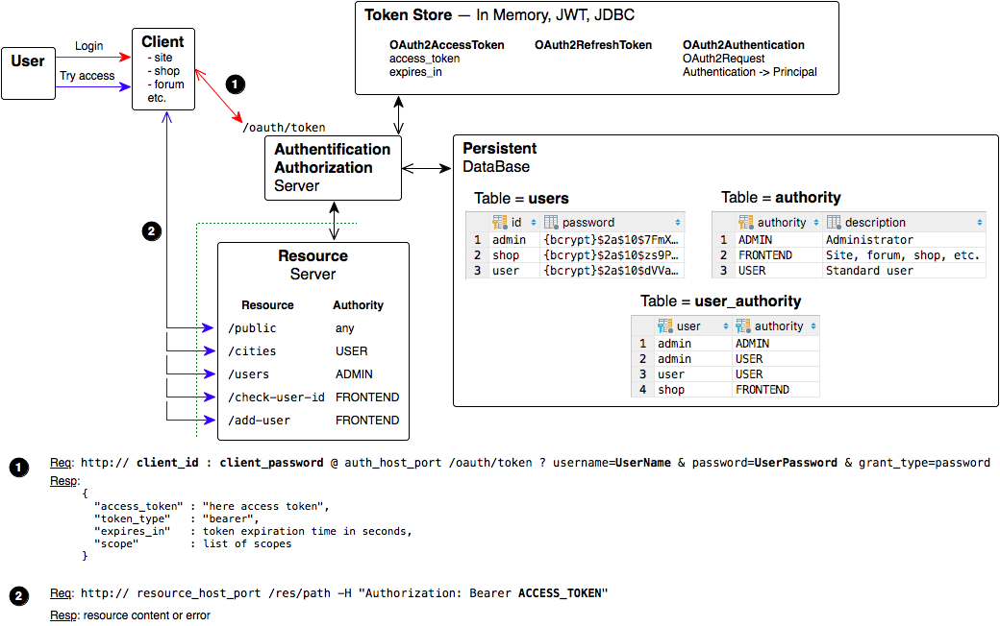

| Token Store          | Branch        |
|----------------------|:-------------:|
| JSON Web Tokens      | `JWT`         |
| In Memory            | `master`      |
<br>
Java 9, Spring Boot 2, OAuth 2, RESTful, MySQL<br>

## API versioning
In this project, the version of the API = "v1", the controller class is called "AppControllerV1".<br>
When developing a new API should create a new controller class, e.g. "AppControllerV2", "AppControllerV3" etc.<br><br>
Unfortunately for resource authentication "/oauth/token" spring-security-oauth2 does not provide for versioning.<br>
Therefore, for all API versions is one version "/oauth/token".

# Automated TESTs
See `test\java\ru.dwfe.authtion` classes.

## AuthorityTest
See screenrecord:
1. Login as: `user`, `admin`, `shop`
2. Try to access as `user`, `admin`, `shop`, `not logged user` to resources:
   * `/public`
   * `/cities`
   * `/users`
   * `/check-user-id`
   * `/create-user`



#### For Manual tests
User Login:
```
curl Standard:Login@localhost:8080/oauth/token -d grant_type=password -d username=user -d password=passUser
```

Admin Login:
```
curl ThirdParty:Computer@localhost:8080/oauth/token -d grant_type=password -d username=admin -d password=passAdmin
```

Shop Login:
```
curl Standard:Login@localhost:8080/oauth/token -d grant_type=password -d username=shop -d password=passFrontend
```

Templates for resources access tests:
```
curl http://localhost:8080/v1/public
curl http://localhost:8080/v1/cities -H "Authorization: Bearer ACCESS_TOKEN"
curl http://localhost:8080/v1/users -H "Authorization: Bearer ACCESS_TOKEN"
curl http://localhost:8080/v1/check-user-id -H "Authorization: Bearer ACCESS_TOKEN"
curl http://localhost:8080/v1/create-user -H "Authorization: Bearer ACCESS_TOKEN"
```
