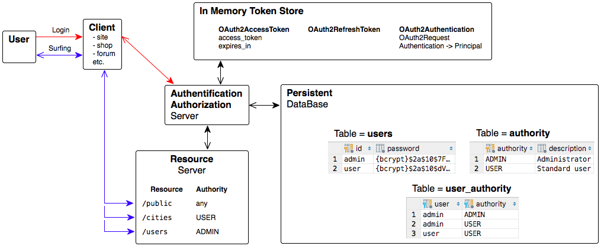

| Token Store Strategy | Branch        |
|----------------------|:-------------:|
| JSON Web Tokens      | `JWT`         |
| In Memory            | `master`      |
<br>
Java 9, Spring Boot 2, OAuth 2, RESTful<br>
<br>

# TESTs
## Automated tests
See `test\java\ru.dwfe.authtion` classes.
### BasicRun
1. Login: `user`, `admin`
2. Try to access with `user`, `admin`, `not loged user` for resources: `/public`, `/cities`, `/users`



#### For Manual tests
User Login:
```
curl Standard:Login@localhost:8080/oauth/token -d grant_type=password -d username=user -d password=passUser
```

Admin Login:
```
curl ThirdParty:Computer@localhost:8080/oauth/token -d grant_type=password -d username=admin -d password=passAdmin
```

Templates for resources access tests:
```
curl http://localhost:8080/public
curl http://localhost:8080/cities -H "Authorization: Bearer ACCESS_TOKEN"
curl http://localhost:8080/users -H "Authorization: Bearer ACCESS_TOKEN"
```
