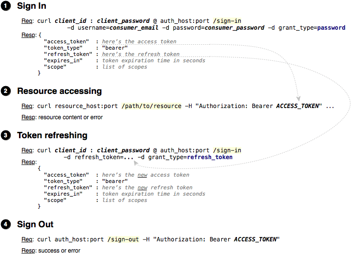

| Token Store          | Branch        |
|----------------------|:-------------:|
| JSON Web Tokens      | `JWT`         |
| In Memory            | `master`      |
<br>
Java 9, Spring Boot 2, OAuth 2, RESTful, MySQL<br>

## API versioning
In this project, the version of the API = "v1", the controller class is called "AppControllerV1".<br>
When developing a new API should create a new controller class, e.g. "AppControllerV2", "AppControllerV3" etc.<br><br>
Unfortunately for resource authentication "/oauth/token" spring-security-oauth2 does not provide for versioning.<br>
Therefore, for all API versions is one version "/oauth/token".

# Automated TESTs
See `test\java\ru.dwfe.authtion` classes.

## AuthorityTest
See screenrecord:
1. Login as: `user@ya.ru`, `admin@ya.ru`, `shop@ya.ru`
2. Try to access as `user@ya.ru`, `admin@ya.ru`, `shop@ya.ru`, `not logged user` to resources:
   * `/public`
   * `/cities`
   * `/users`
   * `/check-user-id`
   * `/check-user-pass`
   * `/create-user`
   * `/confirm-user`

<br>
<br>


#### For Manual tests
`user@ya.ru` login:
```
curl Trusted:trPass@localhost:8080/oauth/token -d grant_type=password -d username=user@ya.ru -d password=passUser
```

`admin@ya.ru` login:
```
curl Untrusted:untrPass@localhost:8080/oauth/token -d grant_type=password -d username=admin@ya.ru -d password=passAdmin
```

`shop@ya.ru` login:
```
curl Trusted:trPass@localhost:8080/oauth/token -d grant_type=password -d username=shop@ya.ru -d password=passFrontend
```

Templates for resources access:
```
curl http://localhost:8080/v1/public
curl http://localhost:8080/v1/cities -H "Authorization: Bearer ACCESS_TOKEN"
curl http://localhost:8080/v1/users -H "Authorization: Bearer ACCESS_TOKEN"
curl http://localhost:8080/v1/check-user-id -H "Authorization: Bearer ACCESS_TOKEN" -H "Content-Type: application/json; charset=utf-8" -X POST -d '{"id": "user"}'
curl http://localhost:8080/v1/create-user -H "Authorization: Bearer ACCESS_TOKEN" -H "Content-Type: application/json; charset=utf-8" -X POST -d '{}'
curl http://localhost:8080/v1/confirm-user -d confirmkey=AnyString
```
