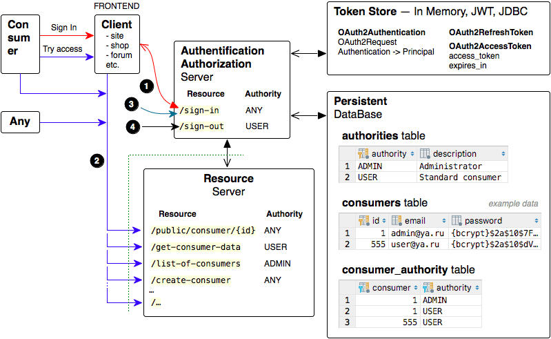
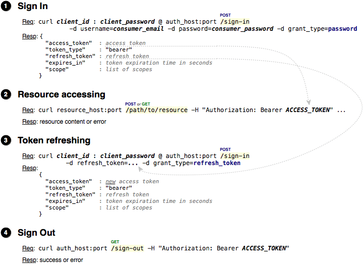
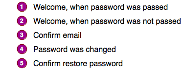
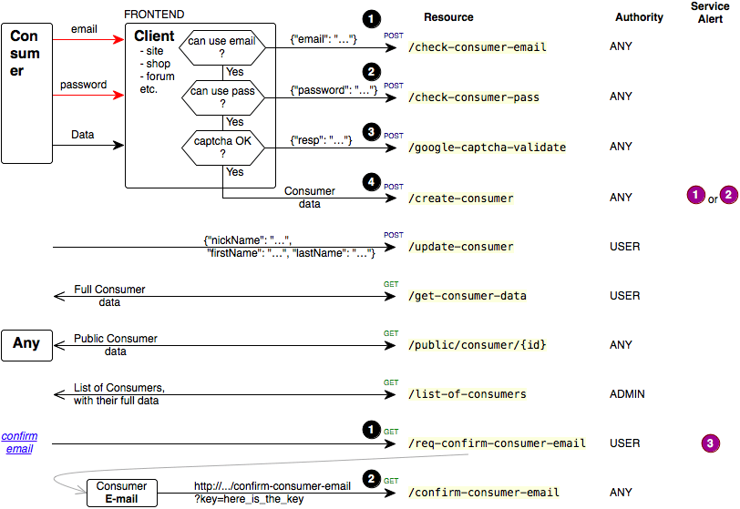
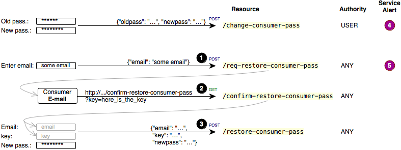

| Token Store          | Branch        |
|----------------------|:-------------:|
| JSON Web Tokens      | `JWT`         |
| In Memory            | `master`      |
<br>
Java10, Spring-Boot2, OAuth2, RESTful, MySQL<br>

## API versioning
In this project, the version of the API = "v1", the controller class is called "ControllerAuthtionV1".<br>
When developing a new API should create a new controller class, e.g. "ControllerAuthtionV2", "ControllerAuthtionV3" etc.<br><br>
Unfortunately for resource authentication `/oauth/token` "out of box" spring-security-oauth2 does not provide for versioning.<br>
Therefore, for all API versions is one version `/oauth/token`, which mapped to `/{current API version}/sign-in`.

# Automated TESTs
See `test\java\ru.dwfe.authtion` classes.

## AuthTest
1. Sign In as: `user@ya.ru`, `admin@ya.ru`, and `some more`
2. Try to access as `user@ya.ru`, `admin@ya.ru`, `not logged user` and `some more` to resources:
   * `/public/consumer/{id}`
   * `/get-consumer-data`
   * `/list-of-consumers`
   * `/create-consumer`
   * etc.

<br>
<br>

<br>

#### For Manual tests
Sign In as `user@ya.ru`:
```
curl Trusted:trPass@localhost:8080/v1/sign-in -d grant_type=password -d username=user@ya.ru -d password=passUser
```

Sign In as `admin@ya.ru`:
```
curl Untrusted:untrPass@localhost:8080/v1/sign-in -d grant_type=password -d username=admin@ya.ru -d password=passAdmin
```

Templates for accessing to resources:
```
curl http://localhost:8080/v1/public/consumer/1
curl http://localhost:8080/v1/get-consumer-data -H "Authorization: Bearer ACCESS_TOKEN"
curl http://localhost:8080/v1/list-of-consumers -H "Authorization: Bearer ACCESS_TOKEN"
curl http://localhost:8080/v1/check-consumer-email -H "Content-Type: application/json; charset=utf-8" -X POST -d '{"email": "admin@ya.ru"}'
curl http://localhost:8080/v1/create-consumer -H "Content-Type: application/json; charset=utf-8" -X POST -d '{"id": "user"}'
...
```

## Email alerts service
<br>

## ConsumerPassword_CRU_Test

### Consumer: Create, Read, Update
<br><br><br>
<br>

### Password management
<br>
<br>
1. Passwords in database are stored as bcrypt hashes in the following format:<br>

2. For resources: `/create-consumer`, `/change-consumer-pass`, `/restore-consumer-pass` - password and newpass can be passed in the raw form or in the form of already encoded bcrypt hash
3. For resource: `/create-consumer` - you may not transmit the password at all. In this case the password will be generated and sent to the consumer e-mail
<br><br>


