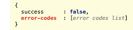
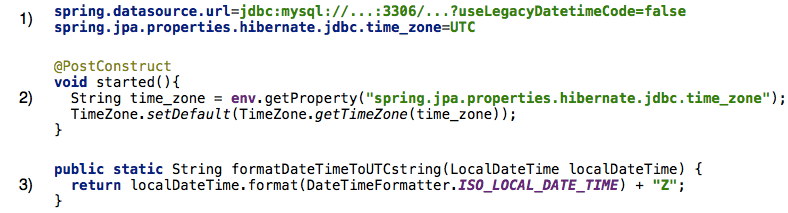
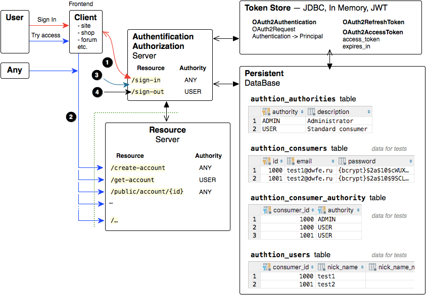
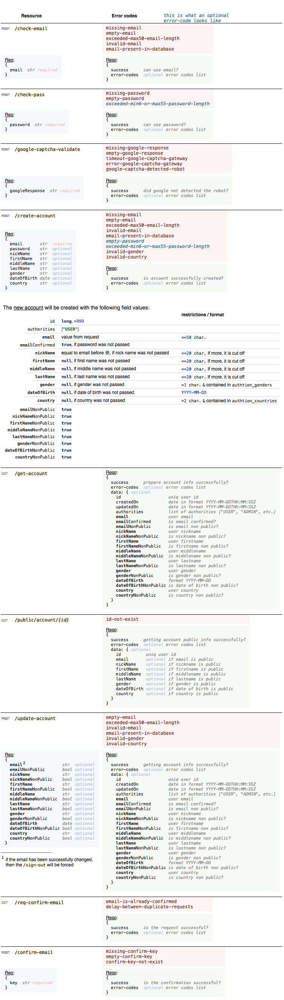
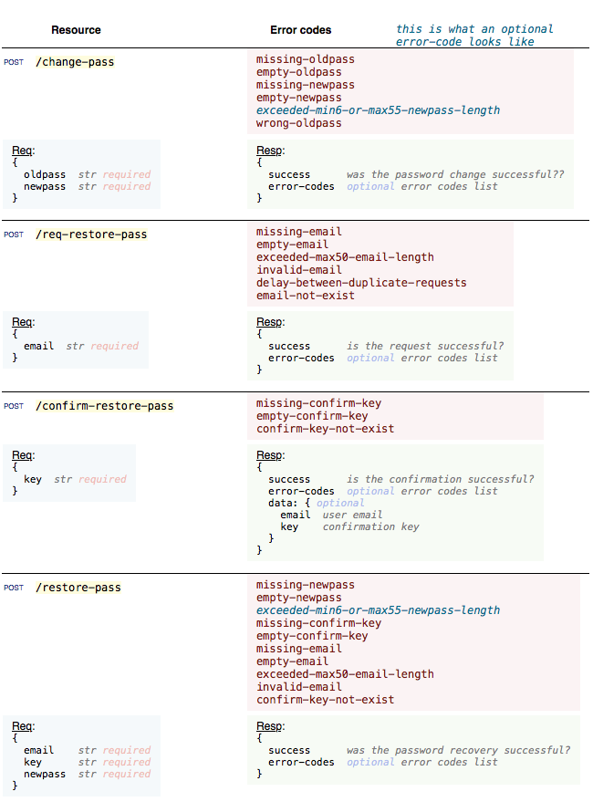

| Token Store          | Branch        |
|----------------------|:-------------:|
| DataBase             | `master`      |
| JSON Web Tokens      | `JWT`         |
<br>
Java10, Spring-Boot2, OAuth2, RESTful, MySQL<br>

[con](#create-read-update)

# API version
In this project, the version of the API = "v1", the controller class is called "AuthtionControllerV1".<br>
When developing a new API should create a new controller class, e.g. "ControllerV2", "ControllerV3" etc.<br><br>
Unfortunately for resource authentication `/oauth/token` "out of box" spring-security-oauth2 does not provide for versioning.<br>
Therefore, for all API versions is one version `/oauth/token`, which mapped to `/{current API version}/sign-in`.

# Errors
When you interact with the Authtion server, you may encounter the following types of errors:<br>
1. OAuth2 server error, which look like this:<br>
<br>
The list of OAuth2 server errors and their mapping is [here](./assets/oauth2-server-errors-mapping.js) (may not include unknown errors to me).
2. Authtion server error, which look like this:<br>
<br>
The list of all Authtion server errors and their mapping is [here](./assets/authtion-server-errors-mapping.js).

# Date and Time
The Authtion server is set to time zone UTC.<br>
<br>
Also, some Authtion database table fields are automatically assigned directly by the database. Therefore, **to work correctly with date and time, you must explicitly set the time zone for mysqld to UTC** (this can be done in [several ways](https://stackoverflow.com/questions/930900/how-do-i-set-the-time-zone-of-mysql#19069310)) or override Authtion server preferences.

# Email alerts

<br><br>
Preparation of mail templates was made in a separate project [authtion-backend-mailing](https://github.com/dowhileforeach/authtion-backend-mailing).
<br>
To fill the mail templates used [Thymeleaf](http://www.thymeleaf.org) template engine.

# Automated TESTs
See `test\java\ru.dwfe.authtion` classes.<br>
The tests cover all API, except for the cases, when the test write is simply impossible. For example, automatic test of `/google-captcha-validate` is not possible without human intervention.

## Auth
1. Sign In as: `test2@dwfe.ru`, `test1@dwfe.ru`, and `some more`
2. Try to access as `test2@dwfe.ru`, `test1@dwfe.ru`, `not logged user` and `some more` to resources:
   * `/public/consumer/{id}`
   * `/get-consumer-data`
   * `/list-of-consumers`
   * `/create-consumer`
   * etc.

<br>
<br>

<br>

#### For Manual tests
Sign In as `test2@dwfe.ru`:
```
curl Trusted:YWPVYGiGLW4Whnr3Q5vuzd8i@localhost:8080/v1/sign-in -d grant_type=password -d username=test2@dwfe.ru -d password=test22
```

Sign In as `test1@dwfe.ru`:
```
curl Untrusted:4rZi5yEhcv5Jb3jSzGPfFFDK@localhost:8080/v1/sign-in -d grant_type=password -d username=test1@dwfe.ru -d password=test11
```

Templates for accessing to resources:
```
curl http://localhost:8080/v1/public/consumer/1
curl http://localhost:8080/v1/get-consumer-data -H "Authorization: Bearer ACCESS_TOKEN"
curl http://localhost:8080/v1/list-of-consumers -H "Authorization: Bearer ACCESS_TOKEN"
curl http://localhost:8080/v1/check-consumer-email -H "Content-Type: application/json; charset=utf-8" -X POST -d '{"email": "some@email.com"}'
curl http://localhost:8080/v1/create-consumer -H "Content-Type: application/json; charset=utf-8" -X POST -d '{"email": "some@email.com", "password": "somepass"}'
...
```

## Consumer

### Create, Read, Update
<br><br><br>
<br>

### Password management
<br>
<br>
1. Passwords in database are stored as bcrypt hashes in the following format:<br>

2. For resources: `/create-consumer`, `/change-consumer-pass`, `/restore-consumer-pass` - password and newpass can be passed in the raw form or in the form of already encoded bcrypt hash
3. For resource: `/create-consumer` - you may not transmit the password at all. In this case the password will be generated and sent to the consumer e-mail
<br><br>


